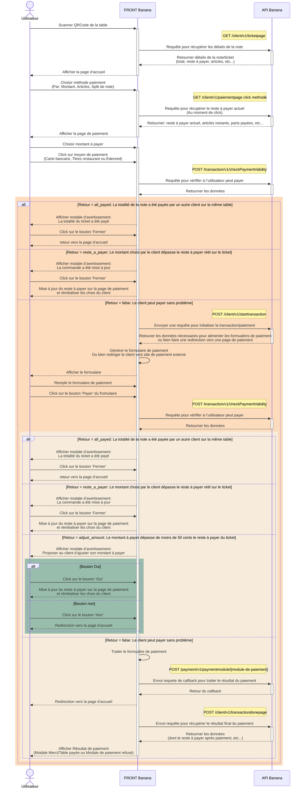

```mermaid
sequenceDiagram
    actor U as Utilisateur
    participant FB as FRONT Banana
    participant AB as API Banana
    %% ---------------------------------
    U->>+FB: Scanner QRCode de la table
    Note left of AB: GET /client/v1/ticketpage
    FB->>+AB: Requête pour récupérer les détails de la note
    AB-->>-FB: Retourner détails de la note/ticket <br/> (total, reste à payer, articles, etc...)
    FB-->>-U: Afficher la page d’accueil
    %% ---------------------------------
    %% ---------------------------------
    U->>+FB: Choisir méthode paiement <br/> (Par: Montant, Articles, Split de note)
    Note left of AB: GET /client/v1/paiementpage click methode
    FB->>+AB: Requête pour récupérer le reste à payer actuel <br/> (Au moment de click)
    AB-->>-FB: Retourner: reste à payer actuel, articles restants, parts payées, etc...
    FB-->>-U: Afficher la page de paiement
    %% ---------------------------------
    %% ---------------------------------
    U->>+FB: Choisir montant à payer
    U->>FB: Click sur moyen de paiement <br/> (Carte bancaire, Titres restaurant ou Edenred)
    Note left of AB: POST /transaction/v1/checkPaymentValidity
    FB->>+AB: Requête pour vérfifer si l’utilisateur peut payer
    AB-->>-FB: Retourner les données
    rect rgb(247 117 3 / 26%)
        alt Retour = all_payed: La totalité de la note a été payée par un autre client sur la même table
            FB-->>U: Afficher modale d’avertissement: <br/> La totalité du ticket a été payé
            U->>FB: Click sur le bouton ‘Fermer’
            FB-->>U: retour vers la page d’accueil
        else Retour = reste_a_payer: Le montant choisi par le client dépasse le reste à payer réél sur le ticket
            FB-->>U: Afficher modale d’avertissement: <br/> La commande a été mise à jour
            U->>FB: Click sur le bouton ‘Fermer’
            FB-->>U: Mise à jour du reste à payer sur la page de paiement <br/> et réinitialiser les choix du client
        else Retour = false: Le client peut payer sans problème
            Note left of AB: POST /client/v1/starttransaction
            FB->>+AB: Envoyer une requête pour initialiser la transaction/paiement
            AB-->>-FB: Retouner les données nécessaires pour alimenter les formualires de paiement <br/> ou bien faire une redirection vers une page de paiement
            FB->>FB: Générer le formulaire de paiement <br/> Ou bien rediriger le client vers site de paiement externe
            FB-->>U: Afficher le formulaire
            U->>FB: Remplir le formulaire de paiement
            U->>FB: Click sur le bouton ‘Payer’ du fromulaire
            Note left of AB: POST /transaction/v1/checkPaymentValidity
            FB->>+AB: Requête pour vérfifer si l’utilisateur peut payer
            AB-->>-FB: Retourner les données
            rect rgb(247 236 219)
                alt Retour = all_payed: La totalité de la note a été payée par un autre client sur la même table
                    FB-->>U: Afficher modale d’avertissement: <br/> La totalité du ticket a été payé
                    U->>FB: Click sur le bouton ‘Fermer’
                    FB-->>U: retour vers la page d’accueil
                else Retour = reste_a_payer: Le montant choisi par le client dépasse le reste à payer réél sur le ticket
                    FB-->>U: Afficher modale d’avertissement: <br/> La commande a été mise à jour
                    U->>FB: Click sur le bouton ‘Fermer’
                    FB-->>U: Mise à jour du reste à payer sur la page de paiement <br/> et réinitialiser les choix du client
                else Retour = adjust_amount: Le montant à payer dépasse de moins de 50 cents le reste à payer du ticket
                    FB-->>U: Afficher modale d’avertissement: <br/> Proposer au client d’ajuster son montant à payer
                    rect rgb(153 189 172)
                        alt Bouton Oui
                            U->>FB: Click sur le bouton ‘Oui’
                            FB-->>U: Mise à jour du reste à payer sur la page de paiement <br/> et réinitialiser les choix du client
                        else Bouton non
                            U->>FB: Click sur le bouton ‘Non’
                            FB-->>U: Redirection vers la page d’accueil
                        end
                    end
                else Retour = false: Le client peut payer sans problème
                    FB->>FB: Traiter le formualire de paiement
                    Note left of AB: POST /payment/v1/paymentmodule/[module-de-paiement]
                    FB->>+AB: Envoi requete de callback pour traiter le résultat du paiement
                    AB-->>-FB: Retour du callback
                    FB-->>U: Redirection vers la page d’accueil
                    Note left of AB: POST /client/v1/transactiondonepage
                    FB->>+AB: Envoi requête pour récupérer le résultat final du paiement
                    AB-->>-FB: Retourner les données <br/> (dont le reste à payer après paiement, etc...)
                    FB-->>-U: Afficher Résultat de paiement <br/> (Modale Merci/Table payée ou Modale de paiement refusé)
                end
            end
        end
    end
    %% ---------------------------------

```
